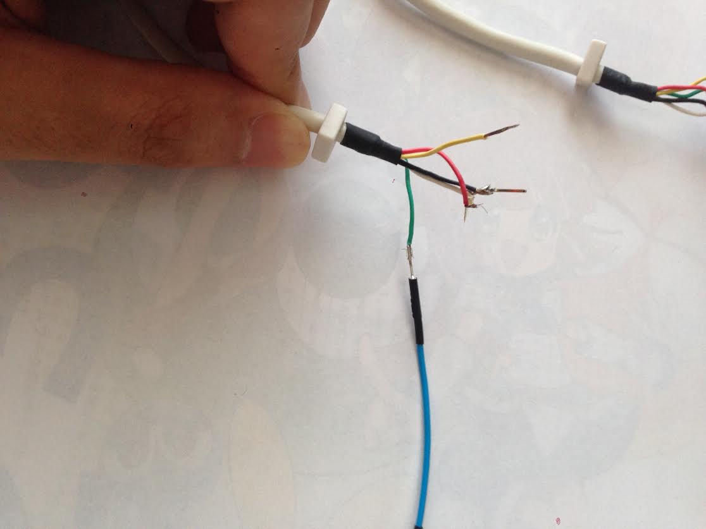

# ハードウェアの作り方

この文章は、puyoaiを実機で動かすためのハードウェアの作り方について記したものです。
お金で解決できる部分はある程度までお金で解決する方針です。

## 買う必要があるもの

- Arduino Uno (R3)
  - R3 レイアウトのものは、SDA および SCL というピンが増えています。R3 でない場合、A5, A6 ピンで代用できます。
- ビデオキャプチャー (EasyCapのチップがsyntek社のもの)
  - これは偽物が非常に多いので注意してください。

## Wii 版作る必要があるもの

- Arduino と Wii リモコンを結ぶための線

Arduinoに、Wii拡張コントローラーのふりをさせることで、ボタンを操作します。
私は、レトコンと呼ばれる拡張コントローラーの線を切って用いました。

1つめの画像がレトコンの基板（裏）です。
この配線を基板の根元からカットして、ジャンパ線を2つめの画像のようにつなぎます。画像では緑だけしかつないでないですが、
白黒、赤、緑、黄色の４つをつなぎます。たまたま緑のジャンパ線をもってなかったので青で代用しましたが、色は揃えたほうがわかりやすくはあります。
白と黒はどちらもGNDなので、まとめてGNDにつないでください。

これをArduinoに挿すだけです。白黒をGND、赤をAREF、緑をSDA、黄色をSCLにつなぎます。

どうも種類によって色が異なるようなので、テスターなどを用いてどの線がWiiコネクタのどの端子に繋がっているのかを確かめてから配線してください。
とりあえずググって参考にしたのが[このような](http://blog.goo.ne.jp/silvernetworks/e/e8dcfa440c54e03812a23e02748c6b4d)ページです。
VCCとGNDを間違えて繋いだりするとショートしてWiiリモコンが壊れたりArduinoが壊れたりが起こるかもしれませんので注意してください。

## アーケード版で作る必要があるもの

TBW

アーケード版のハードウェアは、少々複雑です。

まず、アーケード基板を動かすことができる環境を用意しましょう。そこに「ハーネス」と呼ばれる、基板と筐体を繋ぐための線を挿すのですが、
ここを横取りするという方法を使います。この中間ハーネスを作ることがアーケード版を作る上では必要になります。

基板からは、ビデオ信号として、R, G, B, syncの4つの信号が出ています。これをキャプチャーしたのですが、残念ながらこれを簡単にキャプチャー
できる方法がわからなかったため、S端子の信号に変換する方法を使いました。具体的には、aitendoで売られている
[RGB-VIDEOコンバータ [RGB-VIDEO-CV04N]](http://www.aitendo.com/product/2126)を使いました。
一緒に[端子付きケーブル [JST-5P-SVF]](http://www.aitendo.com/product/1464)も必要です。
また、電源も必要です。私はたまたま家に転がっていたACアダプタを使いましたが、電圧を確認して使ってください。

ボタンですが、基板のボタンは1KΩの抵抗でプルアップされていて、単純にGNDにつなげばボタンを押せたことになり、
ハイインピーダンスにすればボタンを離したことになるようです。そこで、ボタンの線を直接Arduinoのピンに刺し、
Arduino側でピンをGNDとハイインピーダンスを切り替えることでボタンを押すようにしました。
