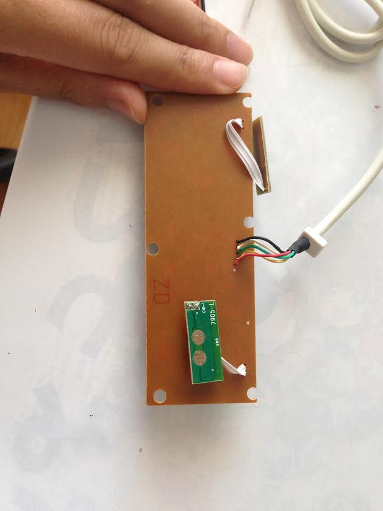

# ハードウェアの作り方

この文章は、puyoaiを実機で動かすためのハードウェアの作り方について記したものです。
お金で解決できる部分はある程度までお金で解決する方針です。

## Wii 版

### 買えば済むもの
- Arduino Uno (R3)
  - R3 レイアウトのものは、SDA および SCL というピンが増えています。R3 でない場合、A5, A6 ピンで代用できます。
- ビデオキャプチャー (EasyCapのチップがsyntek社のもの)
  - これは偽物が非常に多いので注意してください。

### 作る必要があるもの
- Arduino と Wii リモコンを結ぶための線

Arduinoに、Wii拡張コントローラーのふりをさせることで、ボタンを操作します。
私は、レトコンと呼ばれる拡張コントローラーの線を切って用いました。

1つめの画像がレトコンの基板（裏）です。
この配線を基板の根元からカットして、ジャンパ線を2つめの画像のようにつなぎます。画像では緑だけしかつないでないですが、
白黒、赤、緑、黄色の４つをつなぎます。たまたま緑のジャンパ線をもってなかったので青で代用しましたが、色は揃えたほうがわかりやすくはあります。
白と黒はどちらもGNDなので、まとめてGNDにつないでください。

これをArduinoに挿すだけです。白黒をGND、赤をAREF、緑をSDA、黄色をSCLにつなぎます。

どうも種類によって色が異なるようなので、テスターなどを用いてどの線がWiiコネクタのどの端子に繋がっているのかを確かめてから配線してください。
とりあえずググって参考にしたのが[このような](http://blog.goo.ne.jp/silvernetworks/e/e8dcfa440c54e03812a23e02748c6b4d)ページです。
VCCとGNDを間違えて繋いだりするとショートしてWiiリモコンが壊れたりArduinoが壊れたりが起こるかもしれませんので注意してください。

## アーケード版

TBW
